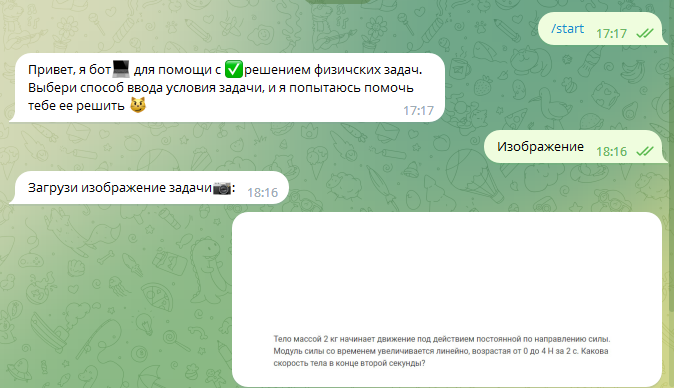
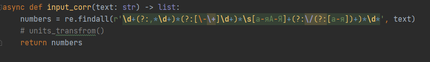
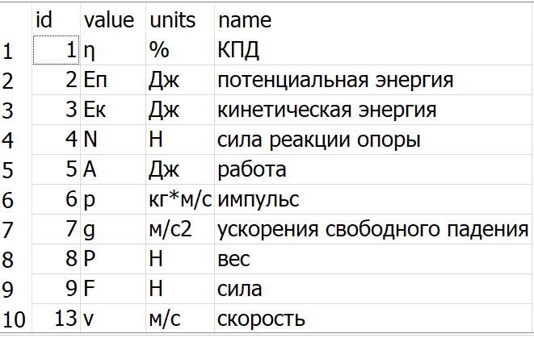
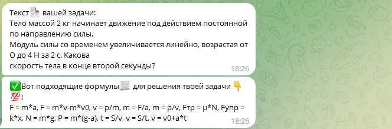

# Physical Telegram bot
#### for help with solving various tasks

***

## User benefit
* Finding useful formulas for solving the task
* ̶С̶o̶m̶p̶l̶e̶t̶e̶ ̶s̶o̶l̶u̶t̶i̶o̶n̶ ̶o̶f̶ ̶t̶h̶e̶ ̶p̶h̶y̶s̶i̶c̶a̶l̶ ̶p̶r̶o̶b̶l̶e̶m̶
* ̶A̶ ̶h̶i̶n̶t̶ ̶f̶o̶r̶ ̶s̶o̶l̶v̶i̶n̶g̶ ̶a̶ ̶p̶r̶o̶b̶l̶e̶m̶ ̶u̶s̶i̶n̶g̶ ̶A̶I̶

## Features
* The ability to enter using an image
*  ̶W̶o̶r̶k̶i̶n̶g̶ ̶w̶i̶t̶h̶ ̶A̶I̶
*  ̶O̶w̶n̶ ̶A̶P̶I̶ ̶i̶s̶ ̶f̶r̶e̶e̶l̶y̶ ̶a̶v̶a̶i̶l̶a̶b̶l̶e̶

## Technologies
* Python 3.10
* requests
* aiogram
* OpenCV

## Working principle

* The User enters a physical task using text <b>or an image</b>

* The bot processes this data by <b>selecting keywords</b> from the text 

* Then the bot finds formulas for the specified physical quantities through the <b>database</b>

* The bot sorts the found formulas by <b>usefulness</b> and outputs them to the user in a readable form
